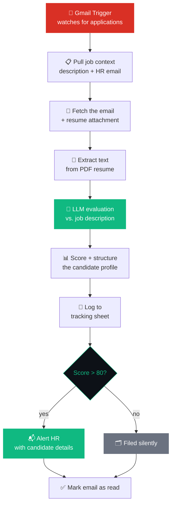

<div align="center">

<br>

# **ResuMatch**


<br><br>

### The AI recruiter that reads every resume so you only see the ones worth your time

<br>


<br>

[](#)
[](#)
[](#)
[](#)


<br>

</div>

---

<br>

> *"Every candidate deserves a fair, consistent read. No hiring manager has time to give every resume the same careful attention on their tenth cup of coffee. ResuMatch does."*

<br>

## Contents

- [What it does](#what-it-does)
- [The pipeline](#the-pipeline)
- [Scoring guide](#scoring-guide)
- [Stack](#stack)
- [The tracking sheet](#the-tracking-sheet)
- [Setup](#setup)

<br>

## What it does

**ResuMatch** watches a Gmail inbox for incoming job applications. The moment one lands, it pulls the resume straight out of the attachment, reads it in full, and evaluates it against your job description the way a sharp technical hiring manager would — skills, frameworks, education, experience, certifications, all of it.

Every candidate is scored, logged, and filed. Only the ones who clear your bar trigger a notification. The rest are still tracked, still fair, just quiet.

<table>
<tr>
<td width="33%" valign="top">

**No skimming**
Every resume gets the same full, careful read — no fatigue, no bias from being the 40th application that day.

</td>
<td width="33%" valign="top">

**No assumptions**
Scores are based only on what's explicitly in the resume. Nothing inferred, nothing assumed.

</td>
<td width="33%" valign="top">

**No noise**
You're only notified for candidates who actually clear the threshold you set.

</td>
</tr>
</table>

<br>

## The pipeline



<br>

## Scoring guide

<div align="center">

| Range | Verdict | What it means |
|:--:|:--|:--|
| 🟢 **90–100** | Excellent match | Exceeds most requirements |
| 🟢 **75–89** | Strong match | Ready for an interview |
| 🟡 **60–74** | Partial match | Worth a look if the pool is thin |
| 🔴 **< 60** | Poor match | Not recommended |

</div>

<br>

## Stack

<div align="center">

| Layer | Tool | Role |
|:--|:--|:--|
| Orchestration | `n8n` | Runs the whole pipeline |
| Inbox monitoring | `Gmail Trigger` | Watches for new applications |
| Resume parsing | `Extract From File` | PDF → raw text |
| Evaluation | `OpenRouter` | Scores against the job description |
| Tracking | `Google Sheets` | Every candidate, logged |
| Notifications | `Gmail` | Alerts HR on strong matches |

</div>

<br>

## The tracking sheet

<div align="center">

| Column | Meaning |
|:--|:--|
| `Name` | Candidate name |
| `Match Score` | 0–100 against the job description |
| `Recommendation` | Strong Hire · Hire · Consider · Reject |
| `Strengths` | Matched skills and qualifications |
| `Weakness` | Missing requirements |
| `Email` | Candidate email — also the matching key |

</div>

<br>

## Setup

```
1.  Create the tracking sheet with the columns above
2.  Create a second sheet holding: job description, HR email, expected subject line
3.  Connect credentials — Gmail OAuth2 · OpenRouter API · Google Sheets OAuth2
4.  Point the Gmail Trigger filter at your application subject line
5.  Set your match-score threshold in the If node   (default: 80)
6.  Set the HR alert recipient
7.  Activate
```

<br>

---

<br>

<div align="center">

**It reads. It scores. It only interrupts you for the ones worth interviewing.**

</div>
